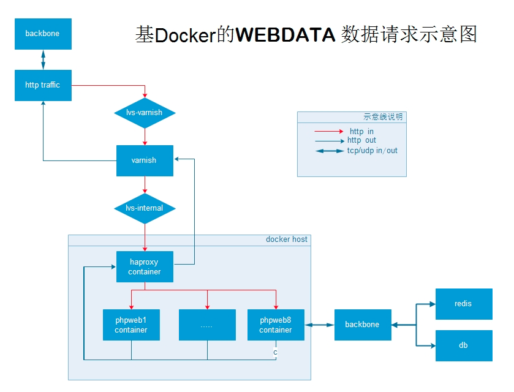

# 在centos7上构建基于docker的应用
---
###这篇文稿主要分两部份,一部份以ppt为原形,相对原ppt,把一些讲的东西细化进这个文稿里,
另一部份则以fanli网web服务器的构建来说明我们如何把docker应用到当前系统架构中.


####此稿重讲述
   * [1.为什么要尝试docker](#why)
   * [2.docker及容器虚拟化和传统虚拟化的区别](#dockervsvm)
   * [3.安装体验](#install)
   
   
   * [2.基本网络架构](#netarch)
   * [3.base镜像构建](#base)
   * [2.网络问题](#network)
   * [3.容器构建及文件共享](#build)
   * [4.应用配置变更后的自动刷新](#app)
   * [5.日志管理](#log)

<a name="why"/>
#### 一.为什么要尝试docker
  目前是为了解决生产环境以虚拟机为单位的phpweb 服务集群横向扩展成本过高的问题.将来会逐渐影响我们内网的开发环境,和生产的应用部署流程和架构.
  
<a name="dockervsvm"/> 
#### 二.docker及容器虚拟化和传统虚拟化的区别

Docker 是一套管理容器虚拟化的工具套件,或者是一套基于容器虚拟化技术实现的容器虚拟化解决方案.主要解决app的构建和-发布-和运行(build->ship-> run)  

更多更专业的解释: 请参考: 

* [1. basics-docker-containers-hypervisors-coreos](http://etherealmind.com/basics-docker-containers-hypervisors-coreos/  
)
* [2. Understanding Docker](https://docs.docker.com/introduction/understanding-docker/#how-does-a-docker-image-work 
)


Container(容器)虚拟化：
基于OS的系统级虚拟化，需内核支持，其原理是将系统资源按照类型和需求分割给多个对象且相互隔离对像使用,比如 linux Container虚拟化是基于cgroup 和namespace 

(Hypervisor) VM虚拟化是基于硬件层面的虚拟化技术, 有三种：全虚拟化、半虚拟化. 
硬件虚拟化,全虚拟化由Hypervisor截获并翻译所有虚拟机特权指令；半虚拟化通过修改虚拟机内核，将部分特权指令替换成与Hypervisor通信;硬件虚拟化借助服务器硬件虚拟化功能，不需要截获虚拟机特权指令，虚拟机也不需要修改内核（比如Intel VT和AMD-V）

摘录一段来自 [basics-docker-containers-hypervisors-coreos](http://etherealmind.com/basics-docker-containers-hypervisors-coreos/)  (此文件基本上是公认的写得比较好的basics docker vs hypervisors 的文章了)

```

Hypervisors virtualize at the hardware level,Containers virtualize at the operating system level

Hypervisors abstract the operating system from hardware, containers abstract the application from the operation system.

Hypervisors consumes storage space for each instance,Containers use a single storage space plus smaller deltas for each layer and thus are much more efficient.

Hypervisors boot according to the OS typically 20 seconds, depending on storage speed
Containers can boot and be application-ready in less than 500ms and creates new designs opportunities for rapid scaling. 

Hypervisors have lower quality APIs that have limited cloud orchestration value,Containers have built-in and high value APIs for cloud orchestration. 

```

	  

	 


关于docker的其它需要了解的:

* 1.docker不是谁的替代者,相比vm他们有各自己的优劣.
* 2.当然针对docker本身来说,它还有很多方面不成熟,比如docker的网络目前仍倾向于单机模式,所以默认情况下他的网络不能很好的容合进当前的网络架构中,尤其针对docker的多主机网络互通,目前仍没有一个得到管方很认可的方案,将来可能会和openvswith 方面做些整合工作,所以如果你业务场景比较复杂,想顺利的融合docker,这个仍需要开发运维做很多工作
* 3.安全问题 相对传统的虚拟机,容器技术从安全的角度上来说也要弱于虚拟机,一是公用内核,另一个是缺少一层中间代理,当然安全这个话题本身就是相对的,所以这里不说
    
<a name="install">
####三. 安装体验
基于官方建义,linux 内核要在3.8以上, 且 3.10.x 建义 ,所以os我们就只接用centos7 了,但是centos6.5 以上也是可以玩的,只是会缺少一些特性而已,所以具体
1.安装
   yum install docker -y

2.启动: 
   service docker start ;

3.确认启动:
   docker info

更多操作系级及安装细节  https://docs.docker.com/installation/ 

##### 1. 基本元素

* 镜像: 一个只读的系统模版,基本上就是一个关了机的虚拟机
* 容器: 基于镜像起动的一个”虚拟机”
* 仓库: 存放和索引镜像

2.基本命令,基本命令分为三大块

* 镜像管理 ,列出已有镜像,创建和删除镜像等
* 容器运行 创建启动关闭等
* 信息显示  列出在运行的实例,实例的具体信息等

3.命令详细列表

* [`docker images`](http://docs.docker.io/reference/commandline/cli/#images) shows all images.
* [`docker import`](http://docs.docker.io/reference/commandline/cli/#import) creates an image from a tarball.
* [`docker build`](http://docs.docker.io/reference/commandline/cli/#build) creates image from Dockerfile.
* [`docker commit`](http://docs.docker.io/reference/commandline/cli/#commit) creates image from a container.
* [`docker rmi`](http://docs.docker.io/reference/commandline/cli/#rmi) removes an image.

----
* [`docker run`](http://docs.docker.io/reference/commandline/cli/#run) creates and starts a container in one operation.
* [`docker stop`](http://docs.docker.io/reference/commandline/cli/#stop) stops it.
* [`docker start`](http://docs.docker.io/reference/commandline/cli/#start) will start it again.
* [`docker restart`](http://docs.docker.io/reference/commandline/cli/#restart) restarts a container.
* [`docker rm`](http://docs.docker.io/reference/commandline/cli/#rm) deletes a container.
* [`docker kill`](http://docs.docker.io/reference/commandline/cli/#kill) sends a SIGKILL to a container.
* [`docker attach`](http://docs.docker.io/reference/commandline/cli/#attach) will connect to a running container.

----
* [`docker ps`](http://docs.docker.io/reference/commandline/cli/#ps) shows running containers.
* [`docker inspect`](http://docs.docker.io/reference/commandline/cli/#inspect) looks at all the info on a container (including IP address).
* [`docker logs`](http://docs.docker.io/reference/commandline/cli/#logs) gets logs from container.
* [`docker top`](http://docs.docker.io/reference/commandline/cli/#top) shows running processes in container.

`docker ps -a` shows running and stopped containers.

---

#### 2. Dockerfile
Docker can build images automatically by reading the instructions from a Dockerfile. A Dockerfile is a text document that contains all the commands you would normally execute manually in order to build a Docker image. 

https://docs.docker.com/reference/builder/ 

####3.logs,data,volumes,network
容器化虚拟机的基本系统可以是只读的,多次复用的,所以app产生的数据一般都是通过卷共享的方式存在于基本系统之外的.这些数据包括Logs,私有数据及共享数据的存储,主要是通过volumes mount来实现.


#####4. docker 网络及我们的实现

Docker 的成熟的网络解决方案仍处在发展期,就目前来说仍然没有最优化的使用方法和最佳实践,所以这个问题得分解着去了解,主要是下面几个问题,主些问题目前都有解决方法,如如果展开来讲又会是一个很大的话题,所以这里不展开太多.

* 容器和宿主机的通信
* 容器和容器间的通信
* 容器和宿主机以外的网络通信
* 宿主机以外的网络和容器通信 

[docker 网络](https://docs.docker.com/articles/networking/)


<a name="netarch">	
####2. 基本架构
   我们的web服务器包括phpweb和javaweb 等相对来说没有复杂的网络场景,但是对于我们来phpweb来说主动流出的流量可能大于主动流进的流量,所以为了谨慎也为了更好的融合进当前的系统架构,所以我们还是需要做一些调整,基本架构请看数据流赂示意图

#####数据流向示意图(系统架构图)


---

#####网络连接示意图
针对我们当前的架构,我们采用macvlan bridge + staticip 的方式,如下图,macvlan的桥接网络性能除了passthou以外应该是最接近物理网卡的性能了,不过网上也有人评测说用openswith的桥接性能会更优一些,为了简化,这个我们可能会考虑测试下.


<a name="base"/>
####二. 基本镜像构建
   
操作系统版本及基本镜像系统版本:

&#8195;&#8195;目前我们使用的所有应用都是基于centos6.3,但基于最近的一次glib库的bug,所以我们把centos更新到了6.5,又基于之前的各种对os的优化对容器应用来说其实无意义,所以放弃自己构建基本系统镜像,转而使用centos官方,好处是管方更新快镜像有针对容器应用做了相应的调整. 
    
    git pull centos:6
	  
2.使用Dockerfile构健应用镜像

  Dockerfile的作用类似于shell 脚本,让特定的过程按按特定的方式走(workflow).简单说确保每一次stage过程.都一样.
  目录结构
    
	 ├── binary
	 │   ├── apache2
	 │   ├── freetds
	 │   ├── lib
	 │   ├── other
	 │   ├── php5
	 │   └── unixODBC
	 ├── cfg
	 │   ├── apache2
	 │   ├── freetds
	 │   ├── php
	 │   ├── system
	 │   └── unixODBC
	 └── scripts	
   

dockerfile

    #  Originally written for Fedora-Dockerfiles by
	#   "Maciej Lasyk" <maciek@lasyk.info>

	FROM fanli:centos6-base
	MAINTAINER  changjun.qi The fanli it team <it@fanli.com>

	# copy  files[cfg,scripts,binary]:
	ADD ./scripts/init_yum.sh  /tmp/init_yum.sh
	ADD ./binary/   /usr/local/
	ADD ./cfg/apache2/conf   /usr/local/apache2/conf
	ADD ./cfg/supervisord.apache2.conf   /etc/supervisord.d/		supervisord.apache2.conf

	# run 
	RUN bash /tmp/init_yum.sh
	RUN yum  -y install gd libmcrypt;yum clean all;
	RUN yum  -y install dhclient.x86_64;yum clean all;
	RUN mv  /usr/local/cronolog /usr/local/sbin/cronolog;
	RUN useradd  -u 501  tuangouadmin  > /dev/null   
  
 <a name="network"/>
2.网络问题:

 docker 支持的网络连接方式有四种:
 详见: https://docs.docker.com/articles/networking/  我们这里只说一下docker默认使用的网络接口方式:  docker默认使用veth接口对,一端放进容器做为一个网络接口,一端放在宿主机上,这样就实现了容器和宿主机的互通,关于veth,请以Linux 虚拟网络设备进行搜索,要创建一个veth接口对,用如下命令就可完成
 	
	ip link add dev vethhost type veth peer name vethguest
	ip addr add 10.0.0.1/24 dev vethhost
	ip addr add 10.0.0.2/24 dev vethguest
	ping -c1 10.0.0.2

进一步基于namespace的演示: http://blog.scottlowe.org/2013/09/04/introducing-linux-network-namespaces/

关于docker的网络互通问题,分解下来,主要是下面几个问题,主些问题都有解决方法,展开来讲是一个很大的话题,所以这里不展开太多,仅以docker默认的网络通信方案做个说明.
 
 1. 容器和宿主机的通信
 2. 容器和容器间的通信
 3. 容器和宿主机以外的网络通信
 4. 宿主机以外的网络和容器通信
  
第一个问题: veth pair 这个方法前面提到过.

第二个问题: veth pair 仅是实现了宿主机和容器接口的互通, 但是容器和容器间的是无法通信的, 这个问题docker默认的解决方式为

宿主机上创建一个桥接口docker0,并配上IP, 然后把多个veth接口对的宿主机端桥接起来. 这样就是桥接的方式让容器和容器互通了

第三个问题: 容器如果网络需要向宿主机以外的网络通信的话,docker默认使用的方式为把veth 桥进接docker0,然后通过 iptables masq,配合ip_forwrod

第四个问题: 宿主机以外的网络默认无法直接和容器通信,docker默认的解决方法为把容器里的应用端口通过iptables nat 到宿主机的IP 的某个端口

docker默认的这种网络网络运作方式,不需要人为的干预,一方面是docker和iptables结合的很紧密,另一方面是docker0的网络对外界是隔离的,所以管理和使用起来都很简单,但是iptbles nat 和masq 都是基于端口的,所以如果如果网络连接量大的话,可能会是一个问题,另一方面,如果容器的应用强依赖外部的某些应用,针对整个架的的透明性来说是减益的.

对于返利网来说,如果要用这种方式也是可以用的,但是我不太喜欢用,一方面我们web服务器需需要和db 和redis 及外界的其它网络有很大的网络通信,另一方面我们也不想通过iptables masq 的方式不容易追踪连接异常问题.

对于我们来说可选的网络方式:
 1.桥接物理网络,方式类似于桥接docker0,从通信的角度来说,不需要iptables,容器网络就可以和当前的网络融合,但有一个很难搞的问题,那就是docker 默认的网络分析是递增的,这样如果docker服务器多的话,这个IP冲突的问题就很头疼,当然可以手动为容器指定IP,但如果机器多了的话,这个IP管理基本上就是不可管理.所以不适合我们
 
 2.宿主机网络,这个顾明思议,容器使用宿主机网络,这个完全避免了容器网络管理问题,但是每个容器里的同一个应用也得监听不同的端口,比如80,81 这样, 当然这个问题很容易解决,比如所有对外的应用走一层代理, 但是这里还有一个问题, 就是如果主机流量大的话,通样因为端口数量有限,对外的连接数可能会成为一个瓶颈.
 
 3.基于物理层的虚拟接口, macvlan 及macvtap 等,因为这个是二层的,使用方式很简单,当是网络层会有很多想像空间,缺点是docker 目前对这个支持的不太好,需要人工干预很多,这个是我们目前暂时使用的方式,具体的我们后面配合代码一起说
 
 4.vxlan,简单来说可以理解为ip over ip,这个是目前一些大形云计算企业都在使用的,当然这里面可发挥的空间也很多,比如华为是通过openswith,当然配物理交换机支持,这是一个相当给力的方式,这里如果要展开有话也会是一个很大的篇幅,预计将来我们会使用这种方式.所以暂时不说太多.
 
 
当然这里也可以给一篇参考: 大家有兴起的可以支看看
   http://containerops.org/2013/11/19/lxc-networking/
   http://blog.oddbit.com/2014/08/11/four-ways-to-connect-a-docker/ 
   
   如果你想自己玩:  可以通过vagrant + vbox 快速构建一个环境  
 
其它开源项目: http://www.infoq.com/cn/news/2014/10/docker-network-project


<a name="build"/>
3.容器构建及文件共享:
&nbsp;&nbsp;这里似乎要简要说一下我们的网站的文件共享及存储架构,那我就先简要说一下吧,页面使用的静态文件,通过一台存储以nfs协议共享到每台服务器,动态文件则是按项目或是域名结构存放到每台服务器,为什么要存放到每台服务器呢? 目前的主要原因是thinkphp框架在运行的时候需要往每个项目录下写缓存及日志文件,这个后面可能会做一些调整,但是现状是这样的.
  我们这些文件使用的特点是都变更的很频烦,所以在这些文件如果放进容器内的话,如果容器多了的话这个更新难度是有一点的,所以这个限制让我们采用挂载宿主机目录的方式来进行.后面会专门讲的日志也是同样的方式,不过我们后面再讲.
  
容器构建:
前面说了我们目前采用网络方式是二层的macvlan,静态指定Ip,这里用起是很爽,但是也有一个目前没有找到解决方案的问题,容器不能重启,一旦重启,容器里的接口会消失,

所以基于这个限制,我们构建容器一个基本的原则是容器里不要存放变动很频烦的文件,还要尽量做到应用的配置文件变动,应用会自动刷新.基于上述限制,所以容器的数据部份:
采用了下面的这些方法
	
  1. 应用的配置文件同样存放在宿主机上,每个容器共享
  2. 代码文件: 以容器名在宿主机上创一个文件夹,然后每个容器挂载,远程共享的文件也是通过挂载.

请看如下代码

     
	   # base dir of storage container's data
	   base="/data/containers"
	   # container's  home
	   # /data/containers/$name/
	   hostdir="${base}/${name}"
   
       volume="
         -v ${hostdir}/weblogs:/data/weblogs/ \
       	 -v ${hostdir}/webdata:/usr/local/webdata/ \
       	 -v ${samba}/fanliweb:/opt/fanliweb \
       	 -v ${samba}/tuangouweb:/opt/webdata \
       	 -v /data/rodata/cfg_file/apache2conf:/usr/local/apache2/conf \
       "

网络部份:
  centos7 默认的docker版本已经完全抛弃了lxc,转而使用自己的libcontainer,所以一些lxc的一些配置已经不能用,而macvlan,docker默认没有做上应的支持,所以我们在容器启动的时候选择--net=none,然后在容器起来之后,再通过ip netns指定相应的ip.如何实现这里请参考pipwork,另关于macvlan,macvtap,请google之,当然macvlan这里有一个限制,就是容器无法和宿主机直接通信,解决方法也很简单,在宿主机上配一个macvlan接口就可以,但是我们容器不需要和宿主机通信,所以这些忽略.具体的构建代码请参考如下:
  
    # create macvtap device
    ip link add link $ifname dev $guest_ifname mtu 1500 type macvlan mode bridge
    # attache macvlan to container
    ip link set $guest_ifname netns $pid
    
    # name macvlan device to namespace as eth0
    ip netns exec $pid ip link set $guest_ifname name eth0
	# set an ip  for eht0 in container host 
	ip netns exec $pid ip addr add $IPADDR dev eth0
   
    #
  
  
  4.应用配置变更后的自动刷新
    前面说到应用配置,每个容器里面的应用配置都是通过共享宿主机的目录来实现变更的,所以这里有两个问题:配置文件变更后,应用自动重新加载,
	如果配置文件变变更后,所以容器自动重新加载后,节点瞬间失效.
	先说第一个问题:
	   1. 进程通过supervisor自动管理, 能过intotify监控配置文件的变更,然后触发supervisor重启相应的应用进程
	   2. 同是重启应用节点瞬间失效
	      我们因为有多台容器服务节点,所以失效一台没关系,当然这个问题原本的解决方案是这样的
		  配置文件在宿主机上放置多份,不同的容器挂载不同的目录,所以先改一个目录,然后配置文件以目录为单位分批次改.
	
	     
  5.日志管理
    主要有几个问题:
	  1. 日志分割
	  2. 日志临时存放
	  3. 日志转储
	
1.日志分割之前的方式是用cronlog,按小时进行分割,这个基于目前的架构问题所以暂时不变,
2.日志临时存放, 以容器名在宿主机上构建共享目录,然后共享,所以日志实际上都存放在宿主机上.如下
	   
	   /data/containers/web08246/weblogs
	   ├── eagle
	   ├── event
	   ├── fun
	   ├── quan
	   ├── static
	   ├── super
	   ├── tuan
	   ├── www
	   └── zhide

3. 日志转储,和之前的方式一样,只是配置文件稍作变更,将来可以考虑日志实时转储.
  

